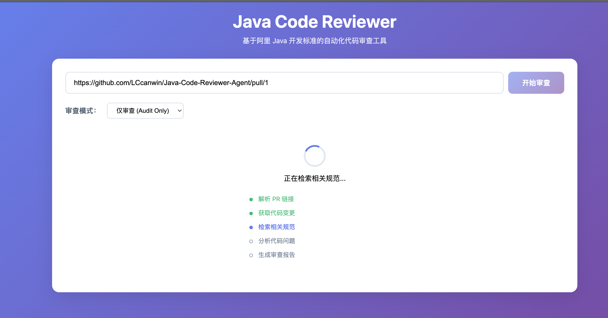
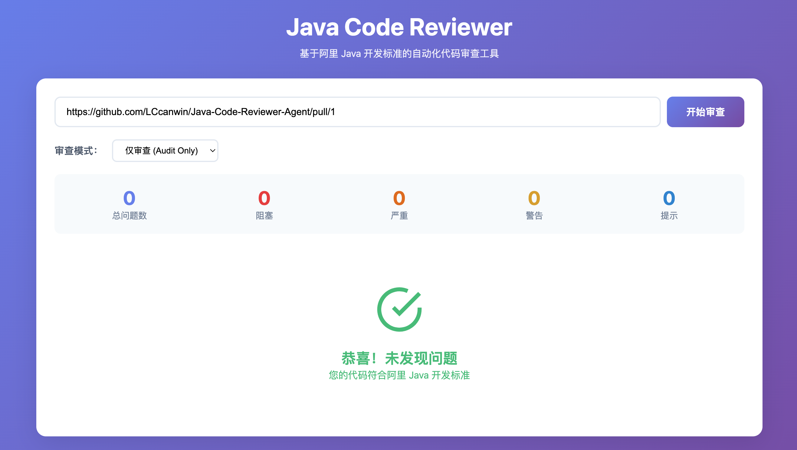
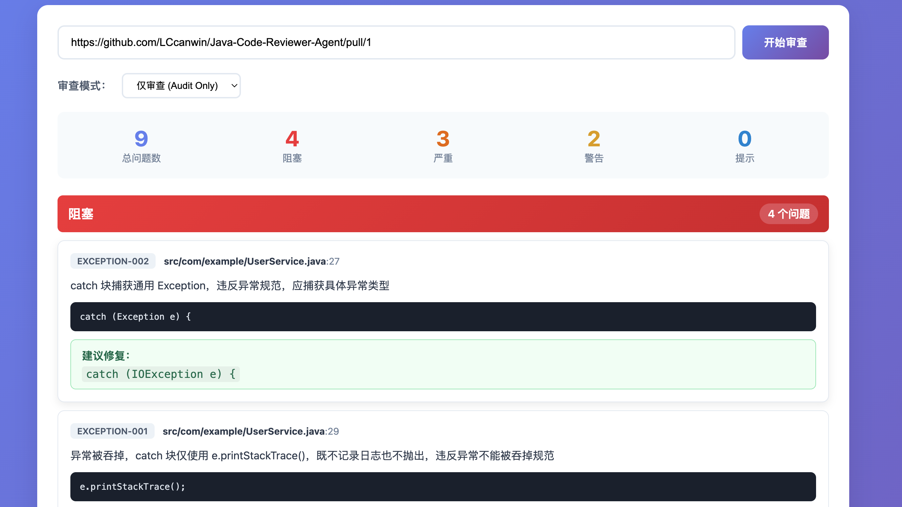

# Java-Code-Reviewer-Agent

基于 LangGraph 的自动化 Java 代码评审系统（Test2 分支测试）

依据阿里巴巴 Java 开发规范（华山版/泰山版）对 Pull Request 进行评审。

## 功能特性

- **多平台支持**：支持 GitHub 和 GitLab PR URL
- **两种评审模式**：
  - `audit_only`：生成 Markdown 格式的问题报告，按严重程度排序
  - `autofix`：生成修复代码并推送新分支到 PR
- **RAG 上下文检索**：基于 FAISS 向量数据库和 OpenAI Embeddings 检索相关阿里巴巴规范
- **迭代反馈**：支持评审反馈校验和受限重试
- **失败恢复与可观测性**：为每次评审生成 `run_id`，记录节点耗时、错误分类和恢复动作

## 系统架构

### Pipeline 流程

评审流程是一个 LangGraph 状态机，关键节点失败时会进入 `failure_handler` 进行受限恢复：

```
input → crawler → context_retriever → planner → reviewer → feedback → option_router → report/patch
                                  ↘ failure_handler ↗
```

```
┌─────────┐    ┌─────────┐    ┌─────────────────┐    ┌──────────┐    ┌──────────┐    ┌─────────┐    ┌──────────────┐    ┌────────┐
│  input  │───→│ crawler │───→│ context_retriever │───→│ planner │───→│ reviewer │───→│ feedback │───→│ option_router │───→│ report │
└─────────┘    └─────────┘    └─────────────────┘    └──────────┘    └──────────┘    └─────────┘    └──────────────┘    │  patch │
                                                                                                                                  └────────┘
```

### 节点说明

| 节点 | 说明 |
|------|------|
| `input` | 验证 PR URL（GitHub/GitLab），检查仓库范围白名单 |
| `crawler` | 通过 GitHub/GitLab API 获取 PR 元数据和 Diff |
| `context_retriever` | 基于 RAG 从 FAISS 向量库中检索相关阿里巴巴规范 |
| `planner` | 分析变更文件，制定评审计划 |
| `reviewer` | LLM（GPT-4o）依据阿里巴巴规范评审代码，输出 JSON 格式问题 |
| `feedback` | 对评审结果进行质量校验，失败时可触发重试或降级 |
| `failure_handler` | 对失败进行分类，选择重试、跳过、降级、部分成功或失败 |
| `option_router` | 根据模式路由到 `report`（audit_only）或 `patch`（autofix） |
| `report` | 生成按严重程度排序的 Markdown 问题报告 |
| `patch` | 创建修复分支、应用补丁、通过 Git 推送 |

### 失败处理与自动恢复

系统采用“确定性策略 + LLM 辅助建议”的恢复机制。代码会先把失败归类并限制可选动作，LLM 只在 `reviewer`、`feedback`、`patch` 等模型相关失败中提供恢复建议，且建议必须通过动作白名单校验。

| 失败类型 | 默认处理 |
|----------|----------|
| `VALIDATION_ERROR` | 直接失败并生成失败报告 |
| `PROVIDER_AUTH_ERROR` / `PROVIDER_NOT_FOUND` | 不重试，直接失败 |
| `PROVIDER_RATE_LIMIT` / `PROVIDER_NETWORK_ERROR` | 按节点重试预算重试 |
| `RAG_ERROR` | 跳过 RAG，上下文为空时继续评审 |
| `LLM_ERROR` / `LLM_PARSE_ERROR` | 可重试，必要时由 LLM 建议修复提示词或降级 |
| `FEEDBACK_REJECTED` | 重试耗尽后降级为 `audit_only`，避免自动修错 |
| `PATCH_GENERATION_ERROR` / `PATCH_PUSH_ERROR` | 重试耗尽后标记 `partial_success`，保留审查报告 |
| `SECURITY_ERROR` | 直接失败，不允许 LLM 覆盖安全决策 |

允许的恢复动作：

```text
retry
retry_with_repair_prompt
fallback_audit_only
skip_node
partial_success
fail
```

每次运行会在 `ReviewState` 中记录：

```python
run_id: str
status: "running" | "success" | "failed" | "partial_success"
current_node: str
node_results: dict[str, NodeResult]
errors: list[ReviewError]
recovery_actions: list[RecoveryAction]
```

每个节点都会记录 `status`、`duration_ms`、`retry_count`、`error_type` 和 `error_message`。日志使用结构化 JSON 输出，包含 `run_id`、节点名、事件、耗时、错误类型和恢复动作，便于接入日志平台或后续扩展 Prometheus/OpenTelemetry。

### 状态管理

`ReviewState` TypedDict 包含整个 Pipeline 的状态：

```python
class ReviewMode(str, Enum):
    AUDIT_ONLY = "audit_only"
    AUTOFIX = "autofix"

class Severity(str, Enum):
    BLOCKER = "blocker"   # 必须修复（强制）
    CRITICAL = "critical" # 强烈建议修复（推荐）
    WARNING = "warning"   # 供参考（参考）
    INFO = "info"         # 仅供参考

class Issue(TypedDict):
    severity: Severity
    rule_id: str          # 例如："NAMING-001"
    file_path: str
    line_number: int
    message: str
    code_snippet: str
    suggestion: str
```

### RAG 系统

- `rag/alibaba_standards.py`：20+ 编码规范规则（命名、异常、并发、集合、SQL、面向对象）
- `rag/knowledge_base.py`：基于 FAISS 的向量数据库，使用 OpenAI Embeddings
- `rag/retriever.py`：从 Diff 中提取 Java 符号，执行相似性搜索

### LLM 集成

`llm/client.py` 支持 OpenAI（默认）和 Anthropic Provider，通过 LangChain 实现。配置方式：

| 环境变量 | 说明 | 默认值 |
|----------|------|--------|
| `LLM_PROVIDER` | "openai" 或 "anthropic" | openai |
| `LLM_API_KEY` | LLM API Key | - |
| `LLM_MODEL` | 模型名称 | gpt-4o |
| `LLM_BASE_URL` | API Base URL（用于代理） | - |

## 项目结构

```
src/java_code_reviewer/
├── main.py              # 入口点，LangGraph 编译
├── config.py            # 配置管理
├── api.py               # FastAPI Web 服务
├── observability.py     # 节点包装、错误分类、结构化日志
├── templates/
│   └── index.html       # 前端页面
├── state/
│   └── review_state.py  # ReviewState、ReviewMode、Severity、Issue 定义
├── nodes/
│   ├── input_node.py         # URL 验证
│   ├── crawler_node.py       # PR 元数据和 Diff 获取
│   ├── context_retriever.py  # RAG 检索
│   ├── planner_node.py       # 评审计划
│   ├── reviewer_node.py      # LLM 代码评审
│   ├── feedback_node.py      # 反馈迭代控制
│   ├── failure_handler.py    # 失败恢复动作选择
│   ├── option_router.py      # 基于模式的路由
│   ├── report_node.py        # Markdown 报告生成
│   └── patch_node.py         # 修复分支创建和推送
├── agents/
│   ├── base.py           # 基础 Agent 类
│   ├── github_agent.py   # GitHub API 集成
│   └── gitlab_agent.py   # GitLab API 集成
├── rag/
│   ├── alibaba_standards.py  # 编码规范规则
│   ├── knowledge_base.py    # FAISS 向量数据库
│   └── retriever.py         # 相似性搜索
├── llm/
│   ├── client.py         # LLM Provider 封装
│   └── prompts.py        # 评审系统提示词
├── git_ops/
│   └── git_manager.py    # Git 操作（补丁）
└── utils/
    ├── diff_parser.py    # Diff 解析工具
    └── severity.py       # 严重级别工具
```

## 安装

```bash
# 克隆仓库
git clone https://github.com/LCcanwin/Java-Code-Reviewer-Agent.git
cd Java-Code-Reviewer-Agent

# 创建虚拟环境
python3 -m venv venv
source venv/bin/activate

# 安装依赖
pip install -r requirements.txt

# Web 界面额外依赖（如果需要）
pip install fastapi uvicorn

# 配置环境变量
cp .env.example .env
# 编辑 .env 填入你的 API Keys
```

## 配置

编辑 `config.yaml` 自定义行为：

```yaml
github:
  token_env: GITHUB_TOKEN        # GitHub Token 的环境变量名
  api_url: https://api.github.com

gitlab:
  token_env: GITLAB_TOKEN        # GitLab Token 的环境变量名
  api_url: https://gitlab.com/api/v4

llm:
  provider: openai               # openai 或 anthropic
  model: gpt-4o
  temperature: 0
  max_tokens: 4096

review:
  max_files: 50                 # 每次评审最大文件数
  max_context_lines: 100        # 每个问题的最大上下文行数

git:
  clone_depth: 1                # 浅克隆深度
  branch_prefix: java-reviewer/  # 修复分支前缀

rag:
  vector_store: faiss
  embedding_model: text-embedding-3-small
  top_k: 5                      # 检索最相关的 K 条规则
```

### 环境变量

| 变量 | 必需 | 说明 |
|------|------|------|
| `GITHUB_TOKEN` | GitHub PR 必需 | GitHub 个人访问令牌 |
| `GITLAB_TOKEN` | GitLab MR 必需 | GitLab 个人访问令牌 |
| `LLM_API_KEY` | LLM 必需 | OpenAI/Anthropic API Key（兼容 `OPENAI_API_KEY`） |
| `SCOPE_LIMIT` | 否 | 允许的仓库范围白名单，逗号分隔（如："org/repo1,org/repo2"） |

## 使用方式

### Web 界面

启动 FastAPI Web 服务，在浏览器中可视化查看审查结果：

**审查进行中：**


**审查成功（未发现问题）：**


**审查完成（含错误结果）：**


服务启动后访问 http://localhost:8000

`POST /api/review` 返回中包含运行状态和恢复信息：

```json
{
  "run_id": "review_xxx",
  "status": "success|failed|partial_success",
  "node_results": {
    "reviewer": {
      "status": "success",
      "duration_ms": 1200,
      "retry_count": 0
    }
  },
  "errors": [],
  "recovery_actions": [],
  "patch_error": null
}
```

### GitHub Actions 集成

```yaml
name: Code Review
on:
  pull_request:
    types: [opened, synchronize]

jobs:
  review:
    runs-on: ubuntu-latest
    steps:
      - uses: actions/checkout@v3

      - name: Set up Python
        uses: actions/setup-python@v4
        with:
          python-version: '3.11'

      - name: Install dependencies
        run: |
          pip install -r requirements.txt

      - name: Run code review
        env:
          GITHUB_TOKEN: ${{ secrets.GITHUB_TOKEN }}
          LLM_API_KEY: ${{ secrets.OPENAI_API_KEY }}
          PYTHONPATH: src
        run: |
          python -c "from java_code_reviewer.main import run_review; \
            result = run_review('${{ github.event.pull_request.html_url }}'); \
            open('review_result.md', 'w').write(result['markdown_report'])"

      - name: Create review comment
        if: always()
        uses: actions/github-script@v7
        with:
          script: |
            const fs = require('fs');
            github.rest.issues.createComment({
              issue_number: context.issue.number,
              owner: context.repo.owner,
              repo: context.repo.repo,
              body: fs.readFileSync('review_result.md', 'utf8')
            })
```

## 阿里巴巴 Java 规范

系统依据阿里巴巴 Java 开发规范进行代码检查，覆盖 20+ 规则：

| 分类 | 规则说明 |
|------|----------|
| 命名规范 | 类、方法、变量命名标准 |
| 异常处理 | Try-catch、throws 声明、异常类型选择 |
| 并发编程 | 线程安全、同步机制、volatile 使用 |
| 集合框架 | List/Map/Set 使用、null 处理 |
| SQL 规范 | PreparedStatement、事务处理 |
| 面向对象 | 继承、接口实现、抽象类设计 |

严重级别：

- **BLOCKER**：必须修复（违反会导致严重问题）
- **CRITICAL**：强烈建议修复
- **WARNING**：建议参考
- **INFO**：仅供参考

## 开发

```bash
# 安装开发依赖
pip install pytest pytest-asyncio

# 运行所有测试
pytest tests/

# 运行单个测试
pytest tests/test_diff_parser.py -v

# 类型检查
python -m py_compile src/java_code_reviewer/main.py
```

## License

MIT
